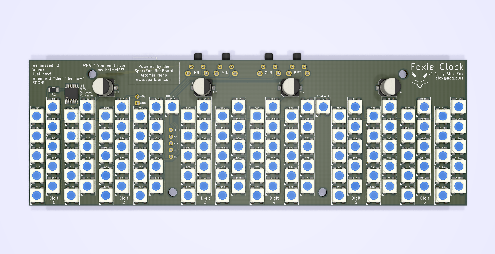

# Foxie Clock
## A Nixie-like, retro, RGB LED, Arduino-powered clock

Welcome to the Foxie Clock, a fully open-source RGB clock with nixie-like edge-lit acrylic digits. Or... an RGB pixel display clock, if you like!

## Looks
With a look inspired by old nixie tubes and with capacitors protruding through the surface like vacuum tubes, the Foxie Clock is a fun, colorful way to display the time at your desk, office, or anywhere. Brightness, color, and time are all adjustable directly with 4 buttons on the back, with much more adjustability via Bluetooth coming in the near future.

# Easy to assemble

The case is fully 3D printed and included with the kit, available in a few colors. 

The circuit board can be ordered fully soldered, or if you like, you can solder the 4 buttons and RedBoard Nano yourself, using the plentiful pictures in the [assembly guide](ASSEMBLY.md).

# Easy to hack
The Foxie Clock is powered by a SparkFun RedBoard Artemis Nano (https://www.sparkfun.com/products/15443), an extremely cool, fully Arduino-compatible board that supports Bluetooth LE 5.0 and much, much more. It is included in every Foxie Clock kit, along with everything you need (except a USB-C cable) to get running.

# 3D Print your own case or modify it yourself!
All .STL models and the full Fusion360 project and the .step files are also available for anyone wanting to make changes to the design more easily. Head over to [Thingiverse](https://www.thingiverse.com/thing:4114349) to download.

# Fully Open Source
The Foxie Clock PCB and firmware were developed using Open Source software. The source code, laser cutting files, PCB design, and documentation for assembly are all freely available here.
